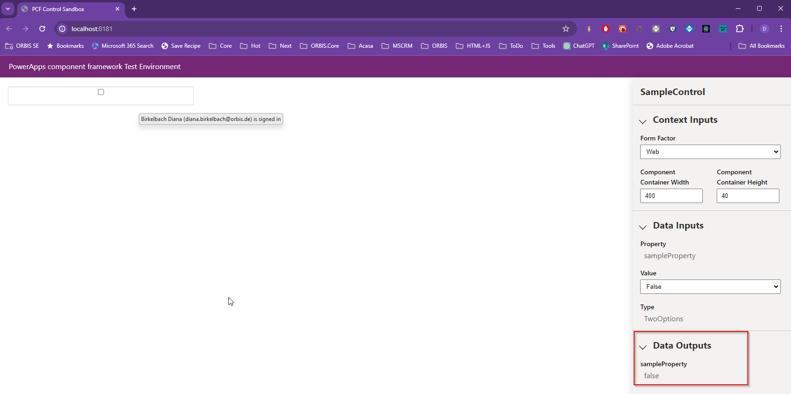

# Lab 1: Hello World PCF

In this lab we will create a first PCF. This will will be a field PCF bound to a boolean/choice field. 
We will use plain HTML/JS, to create a checkbox control. 
We will use the debug harness to test the control.

## Create the PCF project

Create a folder called "1_HelloWorld".
Right click on the folder and open with VSCode.

In VSCode start a new Terminal, and type:

```
pac pcf init -ns Dianamics -n SampleControl -t field
```

This will create a "pcfproj" and a structure like this


Get some time to go through the generated files.

The project contains a "package.json". To install the packages, use the terminal with the command

```
npm install
```

After the installation locate the "ControlManifest.Input.xml" and open it. You can find a "property node". Please change the "of-type" attribute from "SingleLine.Text" to "TwoOptions". You should have this node now:
```xml
<property name="sampleProperty" display-name-key="Property_Display_Key" description-key="Property_Desc_Key" of-type="TwoOptions" usage="bound" required="true" />
```

Now we are ready to build the project 
```
npm run build
```
This will generate the TypeScript definition for the PCF properties. You can find them inside the "SampleControl\generated\ManifestTypes.d.ts".
It will also bundle your code. You can have a look inside the "out" folder:


## PCF Implementation

Open the "index.ts".

First we need to declare the private variables:
```TypeScript
   //type cour code right after the class definition line
   //export class SampleControl implements ComponentFramework.StandardControl<IInputs, IOutputs> {

    private _container: HTMLDivElement;
    private toggle: HTMLInputElement;
    private value: boolean |undefined;

```

### init

Then locate the init method. This is the code called when the PCF gets initialized. Use there this code to create the checkbox:
```TypeScript
    this._container = container;
    this.toggle = document.createElement("input");
    this.toggle.type = "checkbox";        
    this.value = context.parameters.sampleProperty.raw || false;        
    this.toggle.checked = this.value;
    //here we'll add the onChnage
    this._container.appendChild(this.toggle);
```

### updateView
Locate the updateView method and add the following code inside:
```TypeScript
    this.value = context.parameters.sampleProperty.raw ?? false;
    this.toggle.checked = this.value;
```

### Debug Harness

We can try now the PCF. Use the command
```
npm start watch
```
This will start the debug harness, where we can check if the component is working.
You can set the "Width" and "Height", and change the value of the property (Value: True or False), to see that the component is showing it.


But we see that when we change the value using the checkbox we've created, there is not output from the PCF.

That's what we'll do now.

## Outputs

Inside the "init" method, locate the comment we've defined before

```TypeScript
//here we'll add the onChnage
```
and replace it with following:
```TypeSCript
    this.toggle.addEventListener("change", (e) => {
        this.value = this.toggle.checked;
        notifyOutputChanged();
    })
```

Now we've saved the chacked state in a local variable.  

We've also called the "notifyOutputChanged". That will make the platfomr call the method "getOutputs". Now we need to pass that value outside too.

### getOutputs

For that we need to find the "getOutputs" method. This looks like this
```TypeScript
  public getOutputs(): IOutputs
    {
        return {};
    }
```
Replace the return with the following:
```TypeScript
    return {
        sampleProperty: this.value
    };
```

Now we can get back to the debug harness, and check that by clicking on the checkbox, the harness is showing the "Data Outputs" with the values we've passed outside the PCF:


## Cleanup

For a final implementation we would need to implement also the destroy, and the use the "this.toogle.removeEventListener("change", ...);" to detach the event we've attached. 
This exmaple doesn't cleans up the used resources. 
Here is only a reminder to do it for a production implementation.


## Conclusion

Congratulations! 🤩

You've created the first PCF and tested it inside the debug harness.


