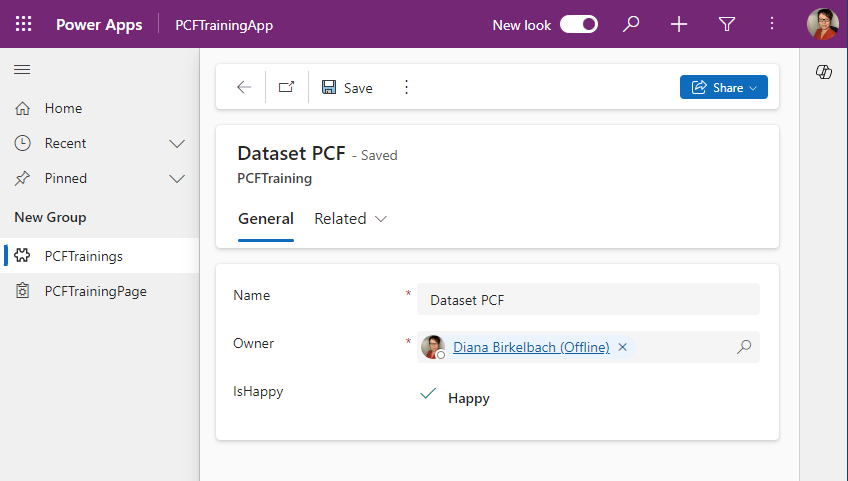
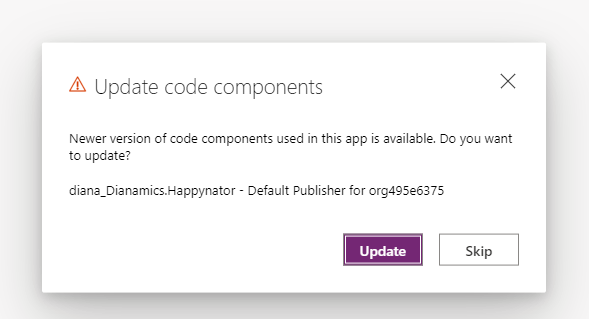
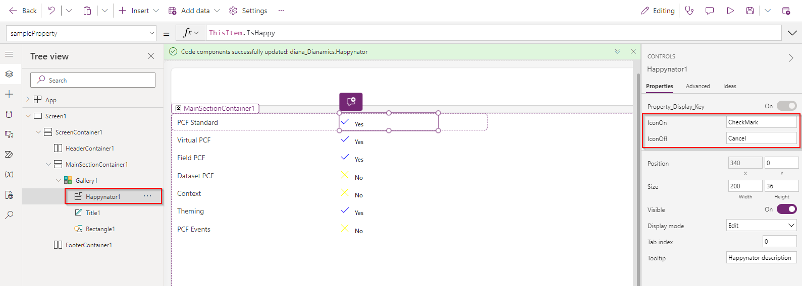

# Modify a PCF

In this lab we will change the Happynator PCF created in Lab 2.1, and will see how to update it in the environment

## Implementation

### The Manifest
We will add two more properties to the manifest

```xml
    <property name="iconOn" display-name-key="IconOn" description-key="IconOn" of-type="SingleLine.Text" usage="input" />
    <property name="iconOff" display-name-key="IconOff" description-key="IconOff" of-type="SingleLine.Text" usage="input" />
```

We need to update the types definition
```
npm run build
```

### Index.ts

Inside the index.ts, locate the updateView method and chnage the code to this:
```TypeScript
    const options = context.parameters.sampleProperty.attributes?.Options || [];
    const props: IIconToggleProps = { 
        colorOn : options[1]?.Color ?? "blue", 
        colorOff : options[0]?.Color ?? "yellow", 
        labelOn : options[1]?.Label ?? "Happy",
        labelOff : options[0]?.Label ?? "Sad",
        iconOn : context.parameters.iconOn.raw ?? "CheckMark", 
        iconOff : context.parameters.iconOff.raw ?? "Cancel", 
        value : context.parameters.sampleProperty.raw || false,
        onChange : this.onChange.bind(this) 
    };
    return React.createElement(
        IconToggle, props
    );
```

We are using now the new properties "iconOn" and "iconOff" and are reading the colors and the labels from th2 sampleProperty.attribute.

If we upload now the PCf to the environment, we can see the updates inside model-driven apps without any change in customizing:
```
pac pcf push -pp diana"
```



But this change won't be reflected inside the Custom Page. Also, we cannot force the CustomPage to refresh the component.
That's because the Custom Page is checking the PCF version.
So we need to increment the PCF version inside the manifest. Change the version to "0.0.2":
```xml
  <control namespace="Dianamics" constructor="Happynator" version="0.0.2"
```

Now we can push again the PCF to the environment

```
pac pcf push -pp diana
```

Reopen the Custom Page, and see that we get asked if we want to update the code component. Choose "Update".



At first we cannot see the icon anymore, so we need to click the Happynator1 and set the IconOn and IconOff (that's because the default values are not null, but empty strings)



Please notice the yellow and blue colors and that the labels are "Yes" and "No" (instead of "Happy" and "Sad" as we had in the customizing and model-driven apps). That means that the PCF is using fallback colors provided in the code. The "attribute" is not containing the colors and the labels.


