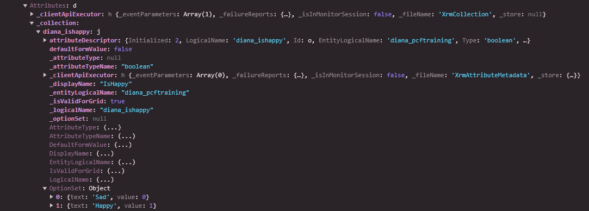
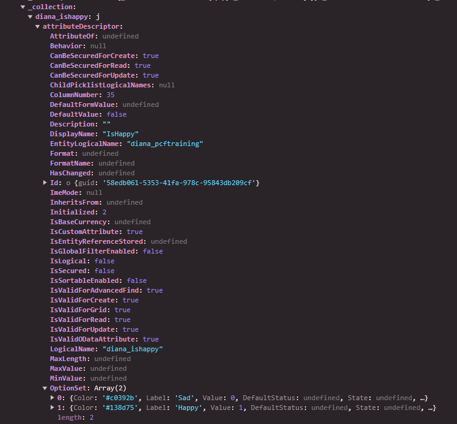
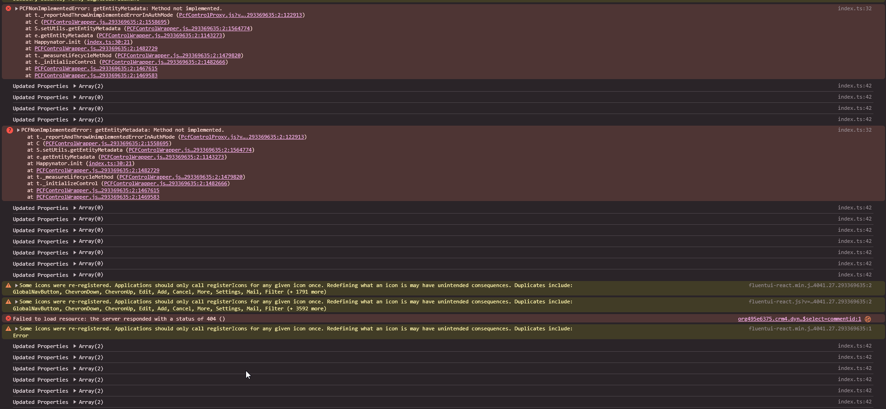
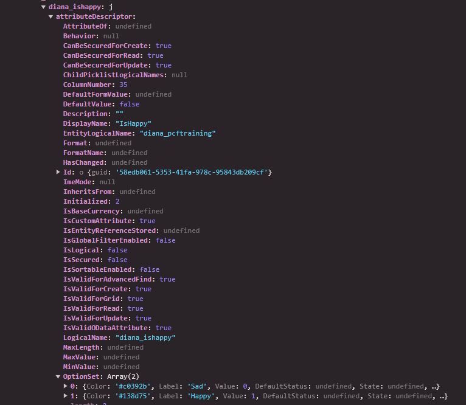

# UpdateView

To see how often the updateView is called, locate the "updateView" method in the index.ts, and add the following line of code
```TypeScript
 console.log(context.updatedProperties);
```

# Metadata

In Custom Page the "attribute" didn't had metadata information (like display name or colors for options).
But we could do that in the PCF. 

Please  notice that this feature is working only inside Custom Pages (not in Canvas Apps).

For that open the Manifest and add the following
```xml
    <feature-usage>
      <uses-feature name="Utility" required="true" />
      <uses-feature name="WebAPI" required="true" />
    </feature-usage>
```
That will allow us to use webAPI and utility features. 

Then, inside the index.ts add the following code inside the "init" method

```TypeScript
    try{
        context.utils.getEntityMetadata("diana_pcftraining", ["diana_ishappy"]).then(console.log);
    }
    catch (error){            
        console.log(error);
    }
```

# Test the code

Then we need to increment the manifest version again

```xml
  <control namespace="Dianamics" constructor="Happynator" version="0.0.3" .../>
```

Upload the PCF to the environment again:
```
pcf pcf push -pp diana
```

Open the form in model-driven apps, refresh it, and open the develope tools to see when the updateView is called.
Also have a look to the metadata logged


In a supported day we get the Labels, but not the colors.

The attributes are there too, but unsupported (through attributeDescriptor)



Now let's do the same with the Custom Page. Reopen it, and update the component.
If we "preview the app" in the maker portal, the console is showing much more "updateView" calls, and also an error because of the metadata request


Make a small change on the page (to work arround a bug during saving if you update only the PCF), then save and publish.

Then run the app again (refresh it), and have a look to the console for the Custom Page.
When the Custom Page is running, we can see the metadata response including colors too:
