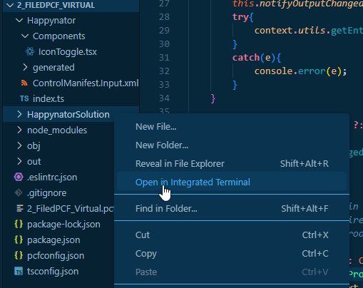
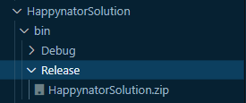

# Create a solution with the PCF

There are several ways to create a solution. One way would be to upload the PCF using "pac pcf push", add the component to a solution and distribute it like this.
One important aspect is to take care to use the minimized version when the Solution will be deployed.

An easier way is to generate solutions containing the PCF. Right from VSCode

To do so , create a subfolder named "HappynatorSolution" (right inside the root) and open in in the Terminal



In the terminal create the solution project (cdsproj):

```
pac solution init -pn Dianamics -pp diana
```

Then we can add a reference to the pcfproj

```
 pac solution add-reference -p ..\
```

Now we can use "msbuild" or "dotnet" to generate the solution containing the latest version of the PCF.

## Using msbuild

We need to be inside the folder containng the "cdsproj".
You need to restore only once.
```
 msbuild /t:restore
 ```

 After that you can create a debug version using 
 ```
 msbuild
 ```

 Or create a production version using

 ```
 msbuild/p:configuration=Release
 ```

 ## Using dotnet

 ```
  dotnet build   
 ```

 That creates the debug solution inside the "bin\Debug" folder
 

and for a production version
```
dotnet build --configuration Release
```
Thet gereated the release solution zip:


