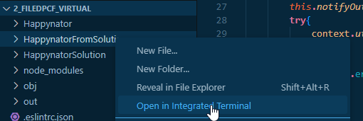
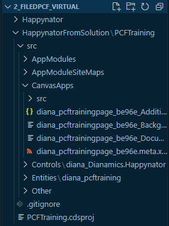
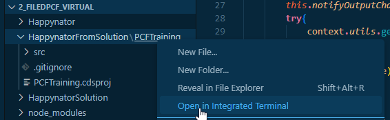
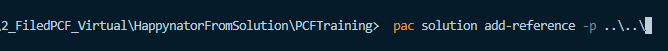

# Include the PCF in an existing Solution

We will use the PCF Training solution, which we will download and then add the PCF reference, just like in the Lab 2.4

We'll create another solution in the root of the project: HappynatorFromSolution.
Open it in the intergated terminal.



We'll start by downloading the PCFTraining solution

```
pac solution clone -n PCFTraining --processCanvasApps
```

This will download the solution and unpack it.
Have a look to the result:



Now open the PCFTraining subfolder in the integrated terminal.



Then we can add a reference to the pcfproj



```
pac solution add-reference -p ..\..\
```

Now we can build the solution just like in lab 4:

Using msbuild:

```
 msbuild /t:restore
 msbuild 
 
 msbuild/p:configuration=Release
 ```

Or using dotnet
```
dotnet build

dotnet build --configuration Release
```