# Virtual PCF

In this lab we will create a virtual code component which we'll use for the boolean/choice field "isHappy" on the form.
We will use it also inside a Custom Page.

## Create Project

The PCF project creation is similat to the standard components:
```
pac pcf init -ns Dianamics -n Happynator -t field -fw react
```

Then we need to install the packages:
```
npm install
```

Then we need to locate the manifest and to change the "property" type to "TwoOptions"
```xml
   <property name="sampleProperty" display-name-key="Property_Display_Key" description-key="Property_Desc_Key" of-type="TwoOptions" usage="bound" required="true" />    
```

Save the file, and build the project
```
npm run build
```

## Preparation

Please create a folder "Components" inside your Happynator folder. Copy there the React component "IconToggle.tsx" from the PCFTraining repository (https://github.com/brasov2de/PCFTraining/tree/main/2_FieldPCF_Virtual/Happynator/Components)

You can delete now the "HelloWorld.tsx".
Your folder structure should look like this:

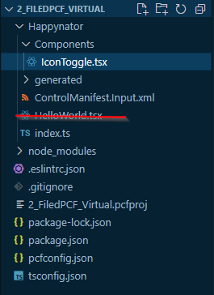

## Implementation

We'll do the following changes inside the index.ts:

Delete the "HelloWorld" import
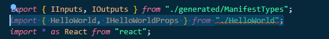

Add the "value" to the private properties, right after the "private notifyOutputChanged"
```TypeScript
private value : boolean |undefined;
```

Add the private onChange method, after the "init" method:
```TypeScript
 private onChange = (value ?: boolean) => {
        this.value = value;
        this.notifyOutputChanged();
    }
```

Replace the content of the updateView with the following:
```TypeScript
    this.value = context.parameters.sampleProperty.raw || false;
    const props: IIconToggleProps = { 
        colorOn : "green", 
        colorOff : "red", 
        labelOn : "Happy",
        labelOff : "Sad",
        iconOn : "Emoji2", 
        iconOff : "Sad", 
        value : this.value,
        onChange : this.onChange.bind(this) 
    };
    return React.createElement(
        IconToggle, props
    );
```

Let the VSCode add the imports for you:
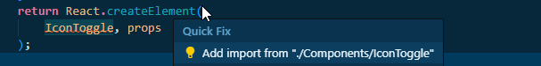

Now implement the "getOutputs" method just like the standard PCF
```TypeScript
 return { 
            sampleProperty : this.value
        };
```

You should be able to build the PCF
```
npm run build
```

### Test the component in the harness

And start the debug harness:
```
npm start watch
```

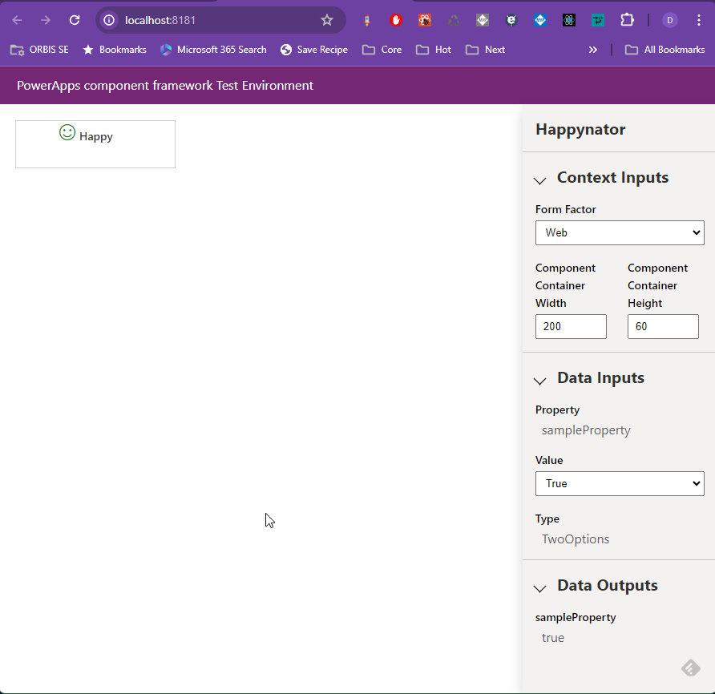

Notice that the component is working in both directions: 
- change the "Data Inputs" and check that the smiley is changing from "Happy" to "Sad" and viceversa.
- click on the smiley will show the true/false in the "Data Outputs" of the debug harness.


## Upload the PCF to the environment

First we need to check that the Power Platform Tools (pac cli) is working with the right environment
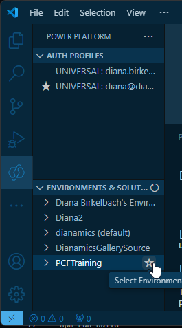

Check your auth profile (it should be universal), and click on the "enviromnet" star corresponding your environment.

You can check also using the Terminal commands

```
pac auth list
pac org who
pac org select -env <id>
```

Now we are ready to upload the PCF to the environment:
```
pac pcf push -pp diana
```

Navigate to your environmet "make.powerapps.com", and open the solution "PCFTraining".

Chose "Ad existing", "More", "Developer", "Custom control"
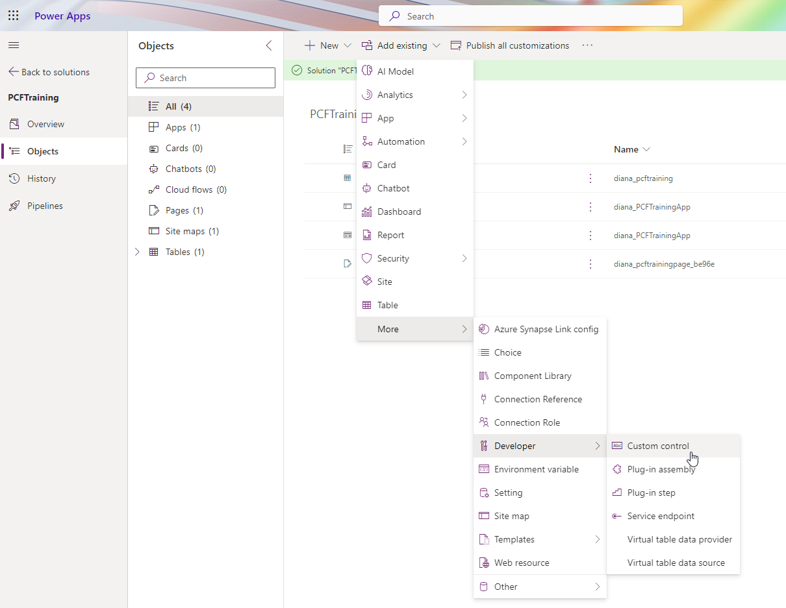

And add the "Happynator" control:
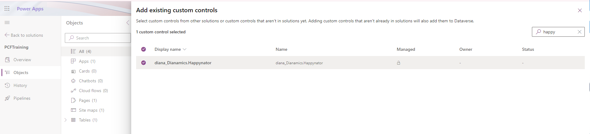

### Using the PCF on a model-driven form

Open the main form for the "PCFTraining" table
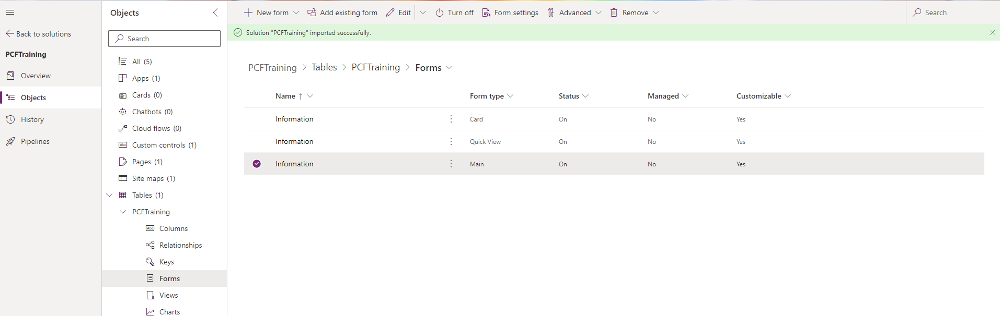
 And attach the Happynator PCF to the "IsHappy" field:
 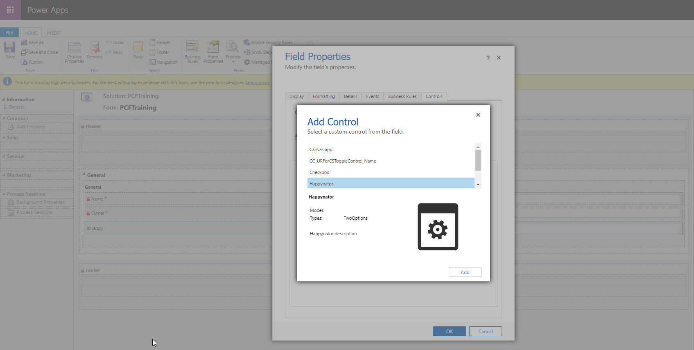

 Save and publish the form.

 Open the "PCFTrainingApp"
 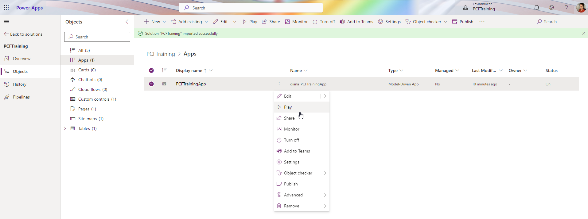

 Create a new record in the table "PCFTraining", and work with the Happynator PCF. Create a few records for this table: we'll need them in the further labs.

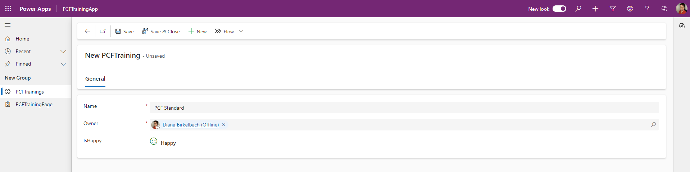

### Using the PCF on a Custom Page

Inside the solution there is a Page "PCFTrainingPage". Open it.
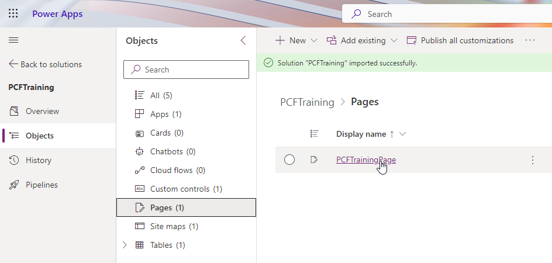

This Page contains a gallery, and the IsHappy property is shown using a toggle control
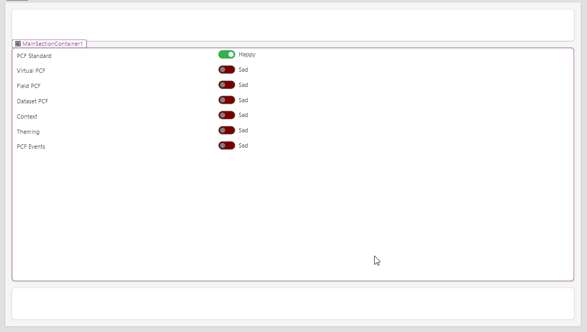

We want to replace it with the happynator.

We need to add the PCF to the page:
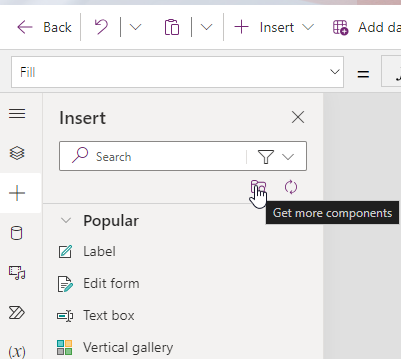

In the dialog which opens, choose the tab "Code", and search for the Happynator component, select it and choose "Import"
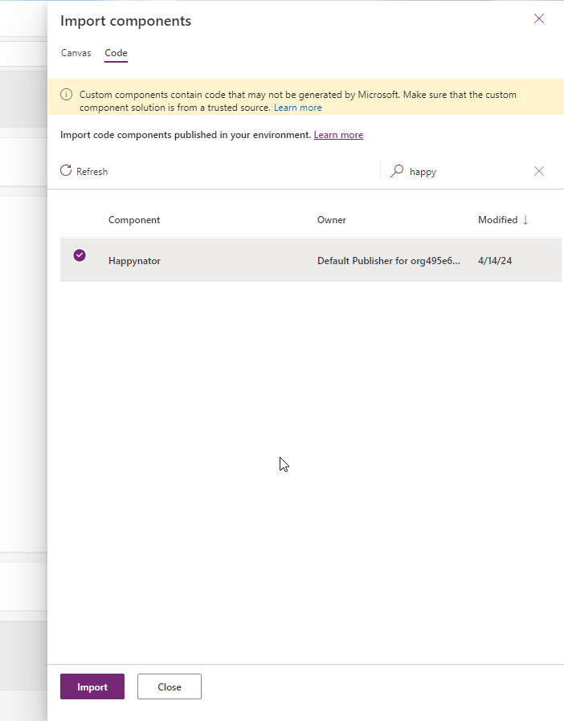

Drag now the Happynator from "Code components" to the Canvas:

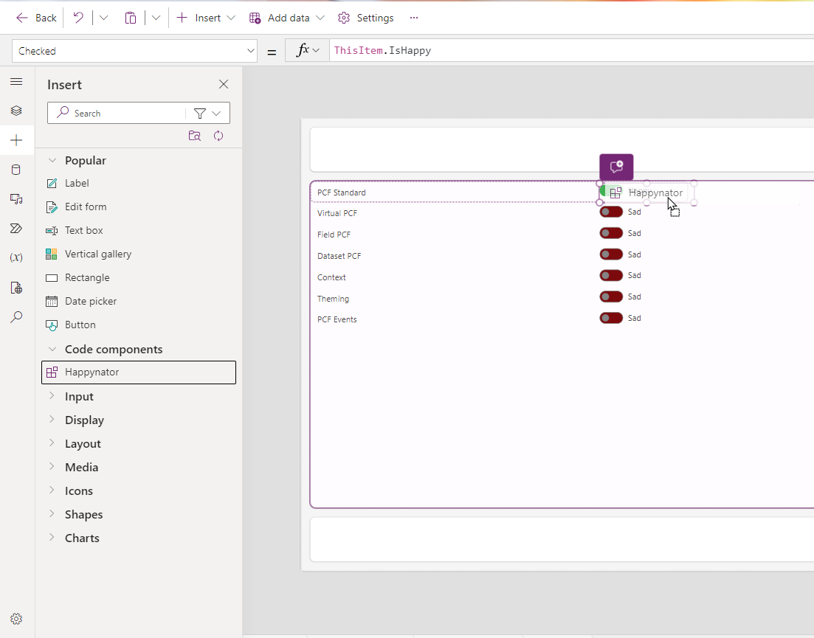

To place it inside the gallery, use "cut", select the "Toggle1" and then "paste":
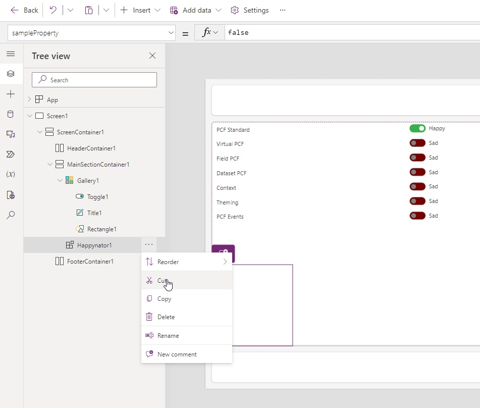

Define the properties for the Happynator1:
 - sampleProperty: ThisItem.IsHappy
 - X: Gallery1.Width-300
 - OnChange: 
 ``` 
 Patch(PCFTrainings, Gallery1.Selected, { IsHappy: Happynator1.sampleProperty})
 ```

 Now we can check that by clicking on the smiley, the value of the Toggle changes too:
 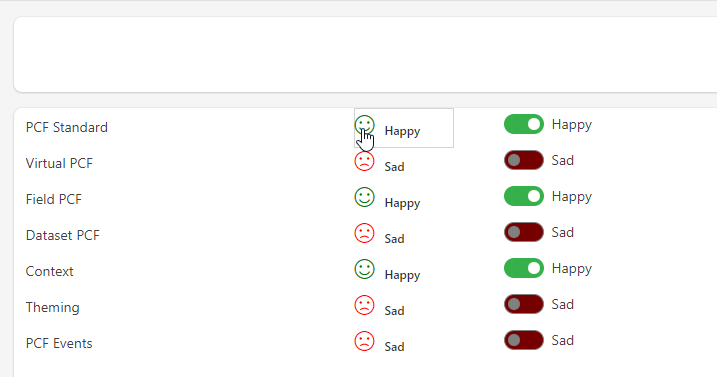

 Now we can delete the Toggle1, save, publish and check the Custom Page inside the App.

 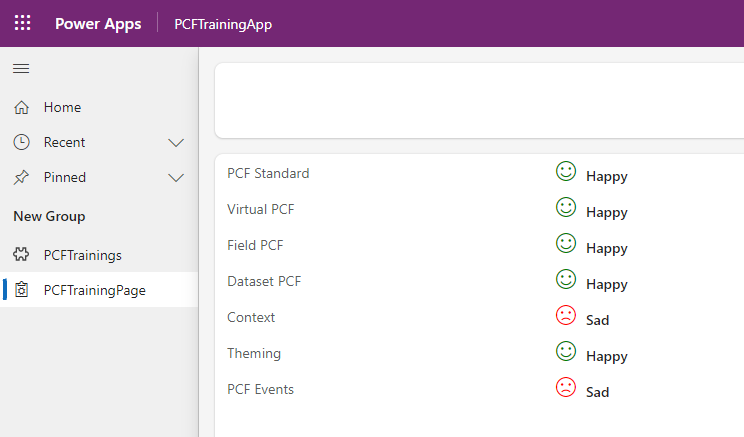