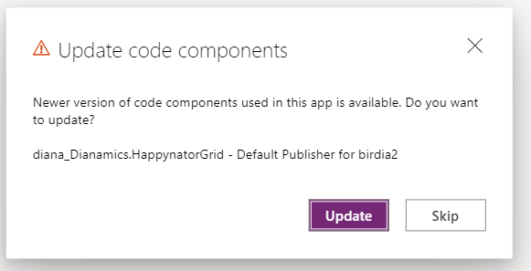
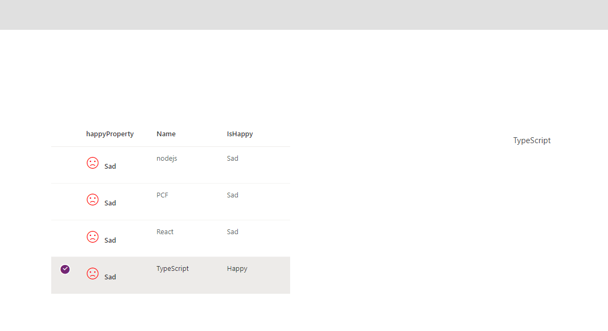

# Lab 3.2

## Purpose

In the lab 3.1 we've uploaded and used the dataset PCF on model-driven view and inside a Custom Page. But the control doesn't interact with the Platform yet.

In this lab we will let the platform know about the row selection. 
Also, we will make the happynator column editable.


## 3.2.1 - Row selection 
Inside the Grid.tsx, we'll use the useSelection custom hook. Define the selection right below the items and columns state
```typescript
const GridInternal = ({dataset}: IGridProps) => {  
  const [items, setItems] = React.useState<TItem[]>([]);
  const [columns, setColumns] = React.useState<IColumn[]>([]);
  //add the code below
  const {selection, selectedCount, onItemInvoked} = useSelection(dataset);
  //....
```
Don't forget to add the import
```typescript
import { useSelection } from './Components/useSelection';
```
Take a look to the useSelection hook inside the "useSelection.ts" file.
We use the dataset method **setSelectedRecordIds(ids)** to interact with Power Apps and tell which records are selected.

Inside this hook there is also the definition of **onItemInvoked**. Here we define the navigation inside model-driven apps, using the **dataset.openDatasetItem**.

Back inside the **Grid.tsx** we'll add the properties to the DetailsList
```typescript
  return (
   <DetailsList   
    items={items}
    columns={columns}    
    selection={selection}
   // selectionMode={SelectionMode.multiple}
    onItemInvoked={onItemInvoked}
   />
  );
```


## 3.2.2 Make the dataset editable

Open the Grid.tsx file, and locate the onRender function inside the column definition. Add the onChange callback prop for the IconToggle.
Your onRender should look like this:

```typescript
  onRender: isHappyColumn ?  (item: TItem) => {
          return <IconToggle 
          iconOn="Emoji2"
          iconOff="Sad"
          colorOn="green" 
          colorOff="red"
          labelOn="Happy"
          labelOff="Sad"
          value={item.raw.getValue(column.name) == true || item.raw.getValue(column.name) == "1"}
          onChange={(value) => {
            const record = item.raw;
            (record as any).setValue(column.name, value);            
            (record as any).save();
          }}
           />
        } : undefined
```

## 3.3.3

Check if your component is still working
```
npm run build
npm start
```

Then stop the tasks inside the VSCode terminal, using Ctrl+C

## 3.2.2 Upload the code
Since we want to see the change also inside the CustomPage, increment the version inside the manifest: set the version to "0.0.2"
```xml
<?xml version="1.0" encoding="utf-8" ?>
<manifest>
  <control namespace="Dianamics" constructor="HappynatorGrid" version="0.0.2" ...>

```

Now upload the component to the environment
```
pac pcf push -pp diana
```

Open the model-driven apps, and select a row in the subgrid. Notice that the ribbon commands are changed, when a row is selected.
You can also change the value of the smiley by clicking on the icon.

**Note**
Calling the "save()" method for a record, will refresh the dataset and recall the updateView.


## 3.2.4 Using the selection inside Custom Pages.

Inside the maker portal, edit the new created Custom Page: "DatasetCustomPage".

Notice the dialog, about updating the PCF


Preview the page. When you select a record in the grid, you can see the label filled with the Name of the SelectedRecord (as defined in Lab 3.1)


**Note**
As of today, working with a boolean in a dataset PCF is different in model-drriven apps and custom pages (canvas app).
The custom page won't save. 
But you can change the onChange callback to this in order to get the dataset to save your changes in CustomPages
```typescript
  onChange={(value) => {
            const record = item.raw;
            //(record as any).setValue(column.name, value);
            //for CustomPage, instead of value use {Id: value}
            (record as any).setValue(column.name, {Id: value})
            (record as any).save();

          }}
```
After making this change:
- increment the PCF manifext version
- use "pac pcf push -pp diana" 
- reopen the Custom Page
- test the grid by clicking on isHappy icon
- make another change on the page (for instance a label showing the HappynatorGrid1.Selected.IsHappy)
- save and publish the page
- you can refresh now the app and see how it works in the final app


