# Lab 3

## Project Setup

1. Create an empty folder named "3_DatasetPCF"
2. Create a virtual PCF project, of type dataset.
```
pac pcf init -ns Dianamics -n HappynatorGrid -t dataset -fw react
```
3. Now you can install the components
```
npm install

```

2. Inside the generated file "HappynatorGrid" add a subfolder "Components" and add the files from this repository.
You should have this structure:

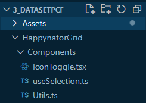

The **IconToggle.tsx** is the same as used in the other labs. Take a short moment to inspect the code. It is looking like this:
```typescript
/* eslint-disable react/display-name */
import * as React from 'react';
import {Icon} from '@fluentui/react/lib/Icon';
import { Label } from '@fluentui/react/lib/Label';
import {mergeStyles} from '@fluentui/react/lib/Styling';

const iconContainerClass = mergeStyles({
    width: "100px",
    height: "40px",
    display: "inline-flex",
    flexWrap: "nowrap",
    justifyContent: "flex-start", 
    alignItems: "baseline" , 
    cursor: "pointer", 
    border: "1px solid transparent"
}, {
    selectors: {
        ":hover": {
            borderColor: "lightGray"            
        }, 
        i: {
            fontSize: "20px", 
            marginTop: "3px"
        },
        label: {
            cursor: "pointer"      
        }
    }
})


export interface IIconToggleProps {
    iconOn: string;
    iconOff: string;
    colorOn: string;
    colorOff: string;
    labelOn : string;
    labelOff : string;
    value: boolean | undefined;
    onChange ?: (value: boolean | undefined) => void;
}

export const IconToggle = React.memo(({iconOn, iconOff, colorOn, colorOff, labelOn, labelOff, value, onChange}: IIconToggleProps) => {
    const changeValue = React.useCallback(() => {
        onChange && onChange(!value);
    }, [value]);
    return (<div className={iconContainerClass} onClick={changeValue}>
        <div style={{width:"30px"}}>
            <Icon iconName={value ? iconOn : iconOff} style={{color: value ? colorOn : colorOff}} ></Icon>
        </div>
        <Label>{value===true ? labelOn : labelOff}</Label>
    </div>)
})
```

The **Utils.ts** contains a helper function to parse the dataset items:

```typescript
type DataSet = ComponentFramework.PropertyTypes.DataSet;

export type TItem={
    key: string,
    raw: ComponentFramework.PropertyHelper.DataSetApi.EntityRecord,
    [key: string]: any
}

export function parseItems(dataset: DataSet): TItem[]{
    return dataset.sortedRecordIds.map((id) => {
        const record = dataset.records[id];
        const attributes = dataset.columns.map((column) => {
          return {                    
            [column.name]: record.getFormattedValue(column.name)
          }
        });
  
        return Object.assign({}, ...attributes,
          {key: record.getRecordId(),
          raw: record        
          });
      });    
}
```

The **useSelection.ts** is a hook which we'll use with the FluentUI Details List later:

```typescript
import * as React from 'react';
type DataSet = ComponentFramework.PropertyTypes.DataSet;
import {Selection} from '@fluentui/react/lib/DetailsList';

export const useSelection = (dataset: DataSet) => {       
    const [selectedCount, setSelectedCount]  = React.useState<number>(0);
    // eslint-disable-next-line no-unused-vars
    const [selection, setSelection] = React.useState(new Selection({
        onSelectionChanged: () => {
            const ids = selection.getSelection().map((item :any) => item.key);
            dataset.setSelectedRecordIds(ids);
            setSelectedCount(ids.length);
        }
    }));

    const onItemInvoked = React.useCallback((item : any) : void => {      
        const record = dataset.records[item.key];
        dataset.openDatasetItem(record.getNamedReference());
    }, [dataset]); 

    return {
        selection, selectedCount, 
        onItemInvoked
    };
  
}
```

## The manifest
inside the file ControlManigfest.Input.xml, we search for the "<data-set ../>" node. We'll change it to:
```xml
    <data-set name="sampleDataSet" display-name-key="Dataset_Display_Key" cds-data-set-options="displayCommandBar:true;displayViewSelector:true;displayQuickFind:true">
      <property-set name="happyProperty" display-name-key="Property_Display_Key" description-key="Property_Desc_Key" of-type="TwoOptions" usage="bound" required="false" />
    </data-set>  
```
Notice the "cds-data-set-options" attribute. That will be used inside model-driven apps subgrids, to specify if the out-of-the-box commandbar, viewselector or quickfind are visible.

Also, we've added the "property-set" node, where we define the alias for the "happyProperty".

Inside the terminal, try to build the code until now
```
npm run build
```

# Lab 3.1 - The code for a dataset PCF using Fluent UI

Delete the generated HalloWorld.tsx, and create a new file Grid.tsx instead.
Define the react function component GridInternal, which we export using React.memo:

```typescript
import * as React from 'react';
import { DetailsList, IColumn } from '@fluentui/react/lib/DetailsList';
import { TItem, parseItems } from './Components/Utils';
import { IconToggle } from './Components/IconToggle';

export interface IGridProps {
  dataset : ComponentFramework.PropertyTypes.DataSet;
}
const GridInternal = ({dataset}: IGridProps) => {  
 

  return (
   <DetailsList   
    items={items}
    columns={columns}
   />
  );
}

export const Grid = React.memo(GridInternal);
```

Now we'll define the items and the columns. First the items (the rows of the grid). For that define an internal react state "items". Using "useEffect" with dependency on dataset, we parse the items
```typescript
const GridInternal = ({dataset}: IGridProps) => {  
  const [items, setItems] = React.useState<TItem[]>([]);  

  React.useEffect(() => {
    setItems(parseItems(dataset));   
  },[dataset]);

  return (
   <DetailsList   
    items={items}
    columns={columns}
   />
  );
}
```
Take a moment to look at the parseItems function. 
We parse the *dataset.sortedRecordIds", which is an array, and for each id we take the record from **datset.records[id]**. 
To get the if for the current record, we use the record method **getRecordId()**, and for each column we read the formatted string using **getFormattedValue**.

Now, let's add the column. We'll add another state for columns
```typescript
const [columns, setColumns] = React.useState<IColumn[]>([]);
```
and inside the useEffect we'll add the columns setter. We get all columns using the dataset.columns. If we have a column with the alias "happyProperty". 
Replace your useEffect with this:

```typescript
  React.useEffect(() => {
    setItems(parseItems(dataset));
    setColumns(dataset.columns.sort((a,b) => a.order - b.order).map((column) => {
      const isHappyColumn = column.alias === 'happyProperty';
      return {
        key: column.name,
        name: column.displayName,
        fieldName: column.name,
        minWidth: column.visualSizeFactor < 10 ? 100 : column.visualSizeFactor,
        onRender: isHappyColumn ?  (item: TItem) => {
          return <IconToggle 
          iconOn="Emoji2"
          iconOff="Sad"
          colorOn="green" 
          colorOff="red"
          labelOn="Happy"
          labelOff="Sad"
          value={item.raw.getValue(column.name) == true || item.raw.getValue(column.name) == "1"}
           />
        } : undefined
      }
    }));
  },[dataset]);
```

Don't forget to save the files.

### Index.ts
Now we can use the Grid.tsx inside the index.ts
All we need to do now, is to change the updateView:
```typescript
   public updateView(context: ComponentFramework.Context<IInputs>): React.ReactElement {
        const props: IGridProps = { 
            dataset: context.parameters.sampleDataSet           
        };
        return React.createElement(
            Grid, props
        );
    }
```

Of course we need to add the import
```typescript
import { IGridProps, Grid } from "./Grid";
//delete the HelloWorls imports here
```
Now we should be able now to build:
```
npm run build
```
If the code is succesfully built, you can start the debug harness
```
npm start watch
```
You should get 3 dummy records with Happynator column:
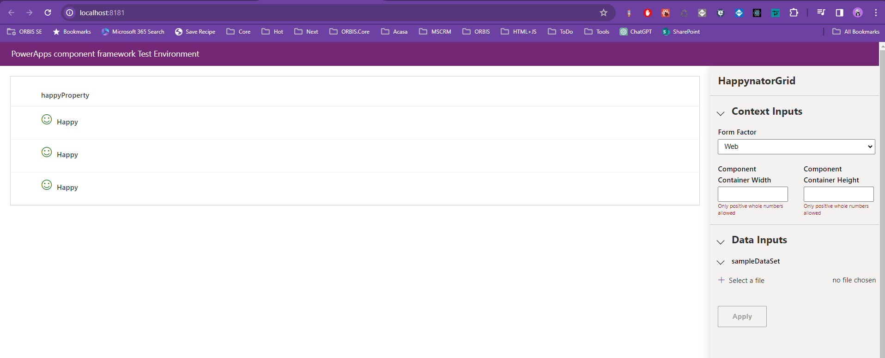

You can stop watch task in the terminal using "Ctrl + C"

## Upload the code component to your environment

Check if your "pac cli" is using the right environment. The "stars" should be set to the right auth profile, and the right environment.

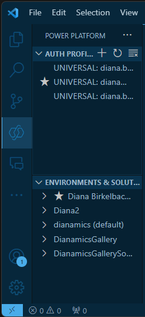

You can also use the "pac cli" commands inside your terminal.
```
pac auth list
//if needed
pac auth create

pac org who
pac org select -env <envid>
```

Upload the debug version using 
```
pac pcf push -pp diana
```

When the upload process id done, open the browser, open the PCFTraining solution inside your environment, and add the new uploaded component "Dianamics.HappynatorGrid" to your solution using "add existing" "Custom Control" button .
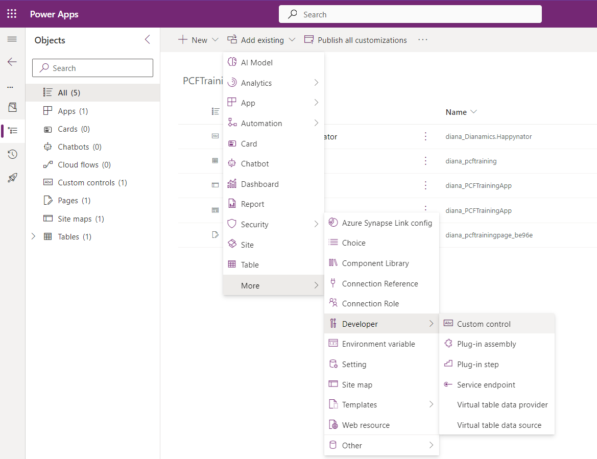

Add the "diana_Dianamics.HappynatorGrid to your solution

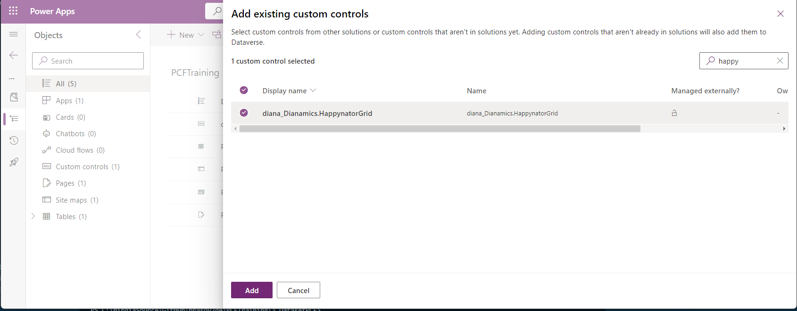

## 3.1.1 Add the PCF to a subgrid in model-driven apps
Open the form for the table PCFTraining in the maker portal. Add a subgrid on the form, taking care to not have checked "Show related records", anch choose the table "PCFTrainings"
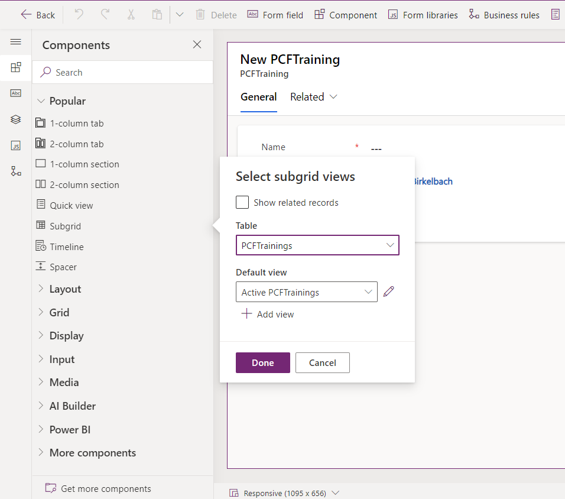

Select the subgrid, and click on "+ Component" button.
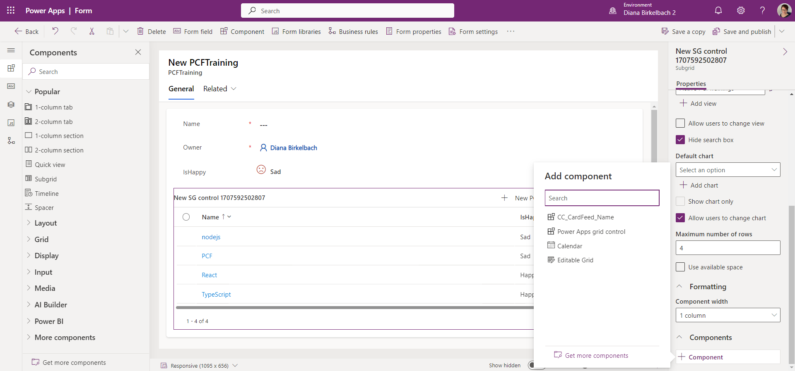
To make the Happynator grid available, click in "Get more components" on the bottom the the flyout which opens there.

Choose the HappynatorGrid, and click ok "Add"
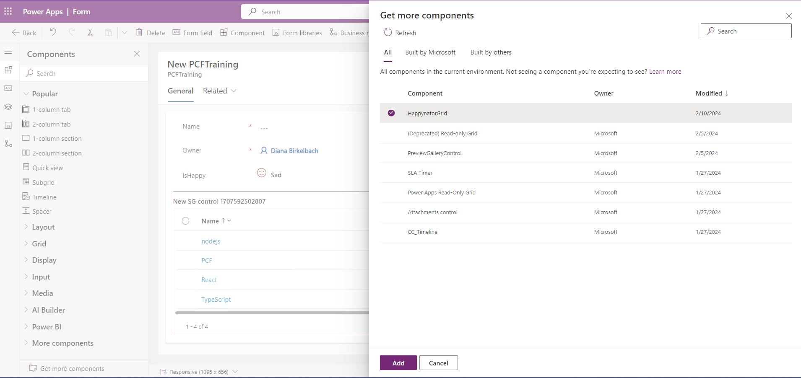

Now choose the HappynatorGrid
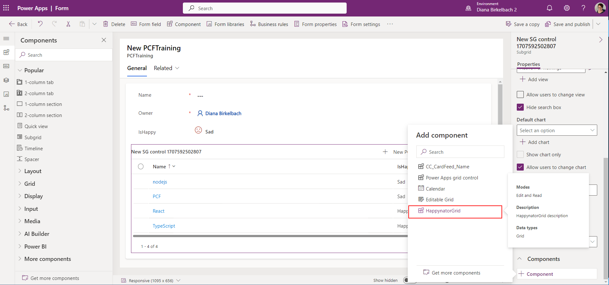

The next flyout will us to choose the column for property-set. Choose the "IsHappy" column.


Allow the view switcher for all views,  the search box, and the number of rows according to the screenshot below:
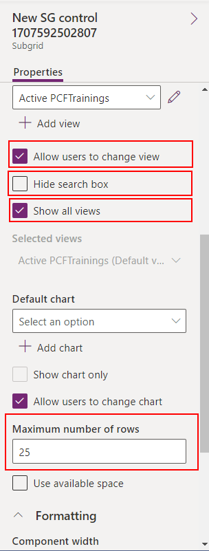
Click on **Save and Publish**.
Check the form for a PCFTrainig record
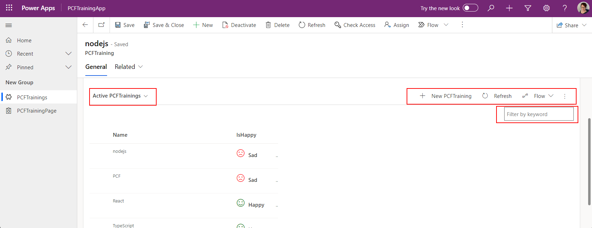

Notice that the standard View switcher, Commands, and Search box.

## 3.1.2 Add the PCF to a Custom Page


# Lab 3.2 - Select rows
Now we'll let the component interact with the Power Apps. 

## 3.2.1 - Code
Inside the Grid.tsx, we'll use the useSelection custom hook. Define the selection right below the items and columns state
```typescript
const GridInternal = ({dataset}: IGridProps) => {  
  const [items, setItems] = React.useState<TItem[]>([]);
  const [columns, setColumns] = React.useState<IColumn[]>([]);
  const {selection, selectedCount, onItemInvoked} = useSelection(dataset);
  //....
```
Take a look to the useSelection hook inside the "useSelection.ts" file.
We use the dataset method **setSelectedRecordIds(ids)** to interact with Power Apps and tell which records are selected.

Inside this hook there is also the definition if **onItemInvoked**. Here we define the navigation inside model-driven apps, using the **dataset.openDatasetItem**.

Back inside the **Grid.tsx** we'll the properties to the DetailsList
```typescript
  return (
   <DetailsList   
    items={items}
    columns={columns}    
    selection={selection}
    selectionMode={SelectionMode.multiple}
    onItemInvoked={onItemInvoked}
   />
  );
```

Check if your component is still working
```
npm run build
npm start
```

Then stop the tasks inside the VSCode terminal, using Ctrl+C

## 3.2.2 Upload the code
Since we want to see the change also inside the CustomPage, increment the version inside the manifest: set the version to "0.0.2"
```xml
<?xml version="1.0" encoding="utf-8" ?>
<manifest>
  <control namespace="Dianamics" constructor="HappynatorGrid" version="0.0.2" ...>

```

## 3.2.3 Using inside model-driven apps

## 3.2.4 Using inside the custom page


