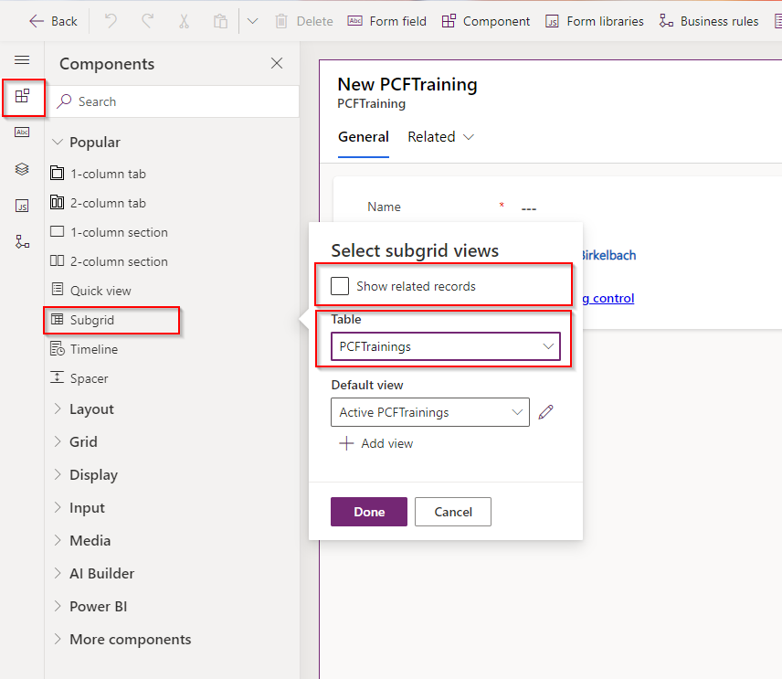

# Dataset using PlainJS

Let's create a pcfproj first.

```
pac pcf init -ns Dianamics -n HappynatorGridPlainJS -t dataset -fw none
```

And install the components:
```
npm install
```

Then locate the online repository for the PCFTraining (or the downloaded zip) and copy all the files from inside "HappynatorGridPlainJS\Components". YOu should find these files:

 

 Take a few moments to look at the content of these files. We have:
 - HappynatorGridPlainJS.css
 - iconToggle.ts : a file where we render the icon toggle 
 - table.ts : some helper functions to render the table (like renderTableHeader or sorting the columns)
 - row.ts : helper functions to render the row and the selection


 ## Manifest

 We will create a dataset PCF where the boolean is shown as a smiley control; that'S why we add the "property-set" inside the data-set node.
 We're also defining the dataset to be able to show the command bar, viewSelector or wuick find in model-driven subgrids:
 Replace the "data-set" node with the following:

 ```xml
<data-set name="sampleDataSet" display-name-key="Dataset_Display_Key" cds-data-set-options="displayCommandBar:true;displayViewSelector:true;displayQuickFind:true">
    <property-set name="happyProperty" display-name-key="Property_Display_Key" description-key="Property_Desc_Key" of-type="TwoOptions" usage="bound" required="false" />
</data-set>
 ```

Then locate the "<resources>" node and place the css inside
```xml
<css path="Components/HappynatorGridPlainJS.css" order="1" />
```

## Index.ts

In the Index.ts, inside the class, define the private variable where we'll create the HTMLTableElement
```TypeScript
private table: HTMLTableElement;
```

Inside the "init" function create the table element and add it to the container:

```TypeScript
    this.table = document.createElement("table");        
    container.appendChild(this.table);
```

## dataset.ts

Now let's create a separate file with the table render function. Create a file "dataset.ts" near the "index.ts" (so inside the HappynatorGridPlainJS).
There we'll create a function renderGrid:

```TypeScript
type  DataSet = ComponentFramework.PropertyTypes.DataSet;
export function renderGrid(table: HTMLTableElement, dataset: DataSet): void {      

}
```

Inside the function, we start with the creation of the header. For that we'll grab the columns, and sort them. Then we'll create the table body.
Then we loop through the ids of the dataset, and get the record. At the end, we'll add the tbody to the created table.
Add this code
Include this code inside renderGrid (And let the VSCode add the imports for you):
```TypeScript
    if(dataset.loading) return;
    const sortedColumns = getSortedColumnsOnView(dataset.columns);   
    renderTableHeader(table, sortedColumns.map(c => c.displayName));

    const tbody = table.createTBody();    
     dataset.sortedRecordIds.forEach((id, i) => {
        const record = dataset.records[id];
        //we'll create a table row for each record
        //we'll loop through the columns
       
    });
    table.appendChild(tbody);
```

To create the row, we'll create the table row, add the row selector. We'll implement the selection in the lab 3.2.
For that, replace the comment "//we'll create a table row for each record" with 
```TypeScript
const row = renderRow({
            id, tbody, 
            index: i, 
            isSelected: false            
        });   
```
Let the VSCode to make the import for the "renderRow".

Now we need to loop through the columns and show the labels. We take the width from the column, and use the dataset.getFormattedValue to get the text we should display in each cell.

Replace the comment "//we'll loop through the columns" with the following
```TypeScript
    sortedColumns.forEach((column, j) => {
            let cell = row.insertCell(j + 1);
            cell.style.width = column.visualSizeFactor < 10 ? "100px" : column.visualSizeFactor + "px";
            if(column.alias === "happyProperty" || column.name === "diana_ishappy") {
                renderHappyCell(cell, {
                    iconOn: "😍",
                    iconOff: "🙁",
                    colorOn: "green",
                    colorOff: "red",
                    labelOn: "Happy",
                    labelOff: "Sad",
                    value: (record.getValue(column.name) as boolean ) == true || (record.getValue(column.name) as any ) == "1"
                });
            }
            else{
                let text = document.createTextNode(record.getFormattedValue(column.name));
                cell.appendChild(text);
            }       
    });
```

The complete dataset.ts should look like this
```TypeScript
import { renderHappyCell } from "./Components/iconToggle";
import { renderRow } from "./Components/row";
import { getSortedColumnsOnView, renderTableHeader } from "./Components/table";


type  DataSet = ComponentFramework.PropertyTypes.DataSet;
export function renderGrid(table: HTMLTableElement, dataset: DataSet): void {      
    if(dataset.loading) return;
    const sortedColumns = getSortedColumnsOnView(dataset.columns);   
    renderTableHeader(table, sortedColumns.map(c => c.displayName));

    const tbody = table.createTBody();    
     dataset.sortedRecordIds.forEach((id, i) => {
        const record = dataset.records[id];
        const row = renderRow({
            id, tbody, 
            index: i, 
            isSelected: false            
        });   
        sortedColumns.forEach((column, j) => {
            let cell = row.insertCell(j + 1);
            cell.style.width = column.visualSizeFactor < 10 ? "100px" : column.visualSizeFactor + "px";
            if(column.alias === "happyProperty" || column.name === "diana_ishappy") {
                renderHappyCell(cell, {
                    iconOn: "😍",
                    iconOff: "🙁",
                    colorOn: "green",
                    colorOff: "red",
                    labelOn: "Happy",
                    labelOff: "Sad",
                    value: (record.getValue(column.name) as boolean ) == true || (record.getValue(column.name) as any ) == "1"
                });
            }
            else{
                let text = document.createTextNode(record.getFormattedValue(column.name));
                cell.appendChild(text);
            }       
    });
       
    });
    table.appendChild(tbody);
}
```

Now we can go back to index.ts and inside the **updateView** call this new created function:

```TypeScript
    public updateView(context: ComponentFramework.Context<IInputs>): void
    {
       renderGrid(this.table, context.parameters.sampleDataSet);
    }
```

Now we can build:

```
npm run build
```

Fix the issues which might appear, and test inside the harness.

```
npm start watch
```


Now we can upload the PCF to the environment (the difference to --publisher-prefix (pp) parametere: the solution-unique-name will add it also to your solution)

```
pac pcf push --solution-unique-name PCFTraining
```

## Using the PCF inside the model-driven apps

Navigate to the main form for the PCFTraining table:


And add the subgrid on the form. Notice that the "Show related records" is unchecked, and that we are using the PCFTrainings for the subgrid:


Set the following flags:
Check: "Allowusers to change view"
Uncheck: "Hide search box"
Check: "Show all views"


Increase the "Maximum number of rows" to 10, and ad the Component HappynatorGridPlainJS.


Select the Table Column "IsHappy (Yes/No)"


Now you can "Save and Publish"

Then open the app and check the subgrid:


Notice that the subgrid has not much interaction with the platform, but the filtering, and the view-swicther are working


## Using the dataset in Custom  Page

This time we will create a new Custom Page and add it to the app.

Open the solution and create a new Custom Page:


Add the PCFTraining data source:


Then add the HappynatorGridPainJS to your page


Now we can drag the PCF to the canvas


And associate the PCFTraining table to the Items of the PCF


Save the Page (DatasetPCFPage) and publish


Then open the App from the PCFTraining Solution, and add the new created page:


Save, Publish and Play the app


