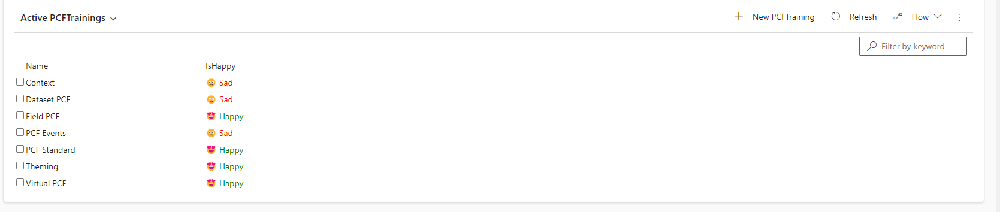
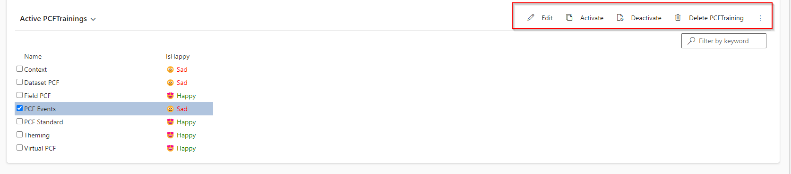
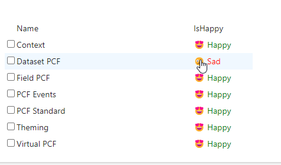
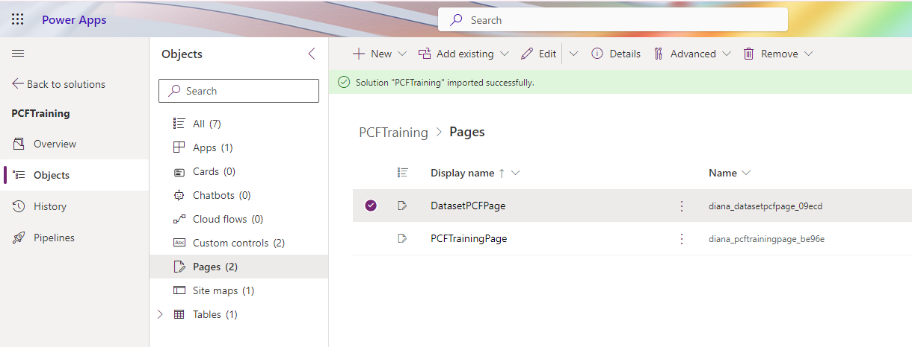
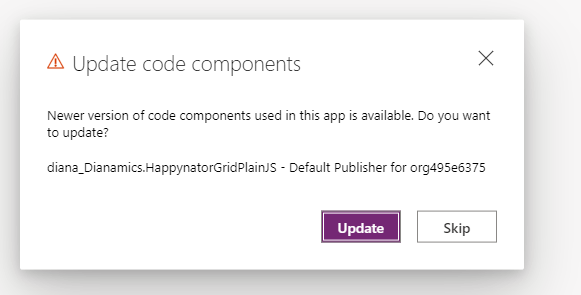
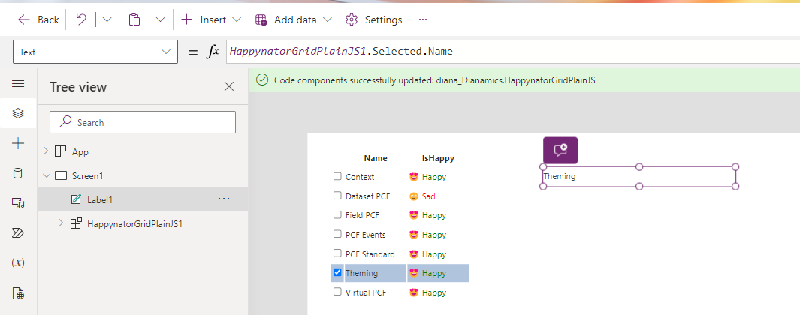
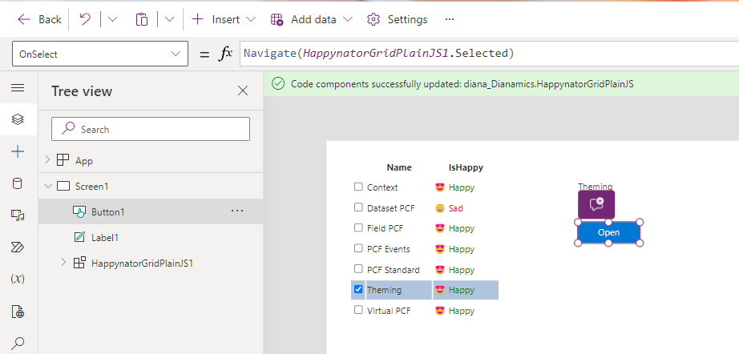

# Dataset: Interaction with the platform

In this lab we will learn to interact with the platform:
 - save changes
 - select a record
 - naigate to a record

 ## Edit & Save Changes

 The IconToggle function already implements an OnChange event. To use it, we just need to pass the onChange callback.
 For that open the **dataset.ts** from the last lab (3.1) and search for the call on "renderHappyCell". We just need to add another parameter

 ```TypeScript
    ,onChange: (value) => {
        (record as any).setValue(column.name, value);
        (record as any).save().catch(console.error);
        }
 ```


Here we call the "setValue" on a record and then call the "save". The save returns a promise, but the dataset is not changed there. Instead, after that the "updateView"  will be called again. There we get the updated dataset.


## Selection and navigation to the record

We've created a row which is able to work with selected state of rows, and is able to treat also double click. The call for now is

```TypeScript
 const row = renderRow({
            id, tbody, index: i, 
            isSelected: false
        });   
```

We will replace it with the following
```TypeScript
    const row = renderRow({
            id, tbody, index: i, 
            isSelected: (dataset.getSelectedRecordIds() ?? []).includes(id), 
            onSelectRow: (ids) => dataset.setSelectedRecordIds(ids),
            onDblClick: () => dataset.openDatasetItem(record.getNamedReference())
        }); 
```

Notice that the dataset has methods to **getSelectedRecordIds**.  

When we want to change the selection, we just need to call **dataset.setSelectedRecordIds**. This will call another updateView, where the dataset is changed accordingly.

The dataset has also a method **opedDatasetItem()**. This is more than a "navigate" possibility inside model-driven apps, because it reflects also the case where the double-click behaviours in home-grids was changed. But this method doesn't work in Custom Page. There we need to work with PowerFx.


We're ready to upload the PCF to the environment.

First increment the PCF version in the PCF manifest
```xml
<control namespace="Dianamics" constructor="HappynatorGridPlainJS" version="0.0.2" 
```

Then push it to the environment

```
pac pcf push -pp diana
```

## Test inside model-driven app

In the app, open a record for the PCFTraining table, and refresh the form.

Notice that now we can select rows by clicking on it, and as soon a row is selected the commans for the selected record are activate.

Unselected:



Selected:



Also, by doubleclicking a row, the corresponsing form will be opened. (Sometimes is not that easy to notice, since we navigate to the same form, just for another record)

Also, by simply clicking on the icon toggle, the value changes and is saved


## Test inside Custom Pages

We need to edit the "DatasetPCFPage":



Since the PCF version was incremented, we get the chance to update the PCF( choose Update):


Place a label on the Page, and set the Text porperty to "HappynatorGridPlainJS1.Selected.Name" As soon we select a record now, we can see the label changing.


To navigate to the record, we can place a button on the form, and set the OnSelect to 

```
Navigate(HappynatorGridPlainJS1.Selected)
```



Now we can save and publish the page and check what happens when we select a record , or when we click on the "Open" Button.

## Disclaimer for saving inside Custom Page

Given the docs, the saving using the dataset save method is GA in model-driven apps, but experimental in Custom Pages.

I've notices that saving works if we set the value as "{Id: value}" instead of "value" as we did in the code. But if we change that won't work inside model-driven apps anymore. 

```TypeScript
//(record as any).setValue(column.name, value)
(record as any).setValue(column.name, {Id: value})
```

Hopefully this will be alligned until the GA for Custom Pages/Canvs Apps. Until then, we could implement it for CustomPages using webAPI. But that'S not a part of this lab.

