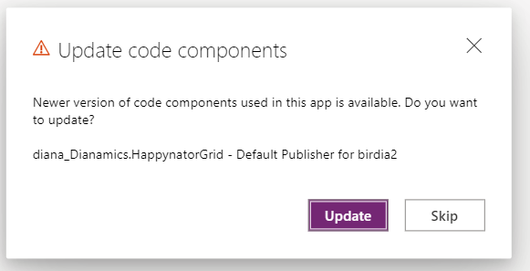
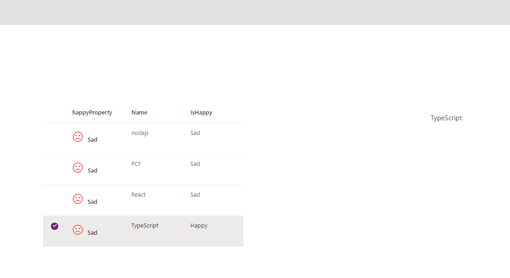

# Lab 3.2

## Purpose

In the lab 3.1 we've uploaded and used the dataset PCF on model-driven view and inside a Custom Page. But the control doesn't interact with the Platform yet.

In this lab we will let the platform know about the row selection. 
Also, we will make the happynator column editable.


## 3.2.1 - Row selection 
Inside the Grid.tsx, we'll use the useSelection custom hook. Define the selection right below the items and columns state
```typescript
const GridInternal = ({dataset}: IGridProps) => {  
  const [items, setItems] = React.useState<TItem[]>([]);
  const [columns, setColumns] = React.useState<IColumn[]>([]);
  //add the code below
  const {selection, selectedCount, onItemInvoked} = useSelection(dataset);
  //....
```
Don't forget to add the import
```typescript
import { useSelection } from './Components/useSelection';
```
Take a look to the useSelection hook inside the "useSelection.ts" file.
We use the dataset method **setSelectedRecordIds(ids)** to interact with Power Apps and tell which records are selected.

Inside this hook there is also the definition of **onItemInvoked**. Here we define the navigation inside model-driven apps, using the **dataset.openDatasetItem**.

Back inside the **Grid.tsx** we'll add the properties to the DetailsList
```typescript
  return (
   <DetailsList   
    items={items}
    columns={columns}    
    selection={selection}
   // selectionMode={SelectionMode.multiple}
    onItemInvoked={onItemInvoked}
   />
  );
```


## 3.2.2 Make the dataset editable

Open the Grid.tsx file, and locate the onRender function inside the column definition. Add the onChange callback prop for the IconToggle.
Your onRender should look like this:

```typescript
  onRender: isHappyColumn ?  (item: TItem) => {
          return <IconToggle 
          iconOn="Emoji2"
          iconOff="Sad"
          colorOn="green" 
          colorOff="red"
          labelOn="Happy"
          labelOff="Sad"
          value={item.raw.getValue(column.name) == true || item.raw.getValue(column.name) == "1"}
          onChange={(value) => {
            const record = item.raw;
            (record as any).setValue(column.name, value);            
            (record as any).save();
          }}
           />
        } : undefined
```


Check if your component is still working
```
npm run build
npm start
```

Then stop the tasks inside the VSCode terminal, using Ctrl+C

## 3.2.3 Upload the code
Since we want to see the change also inside the CustomPage, increment the version inside the manifest: set the version to "0.0.2"
```xml
<?xml version="1.0" encoding="utf-8" ?>
<manifest>
  <control namespace="Dianamics" constructor="HappynatorGrid" version="0.0.2" ...>

```

Now upload the component to the environment
```
pac pcf push -pp diana
```

## 3.2.4 Test the app in model-driven apps

Open the model-driven apps, and select a row in the subgrid. 
- Notice that the ribbon commands are changed, when a row is selected.
- You can also change the value of the smiley by clicking on the icon.
- Double click on the record in subgrid will navigate to the record form.

**Note**
Calling the "save()" method for a record, will refresh the dataset and recall the updateView.


## 3.2.5 Using the selection inside Custom Pages.

Inside the maker portal, edit the new created Custom Page: "DatasetCustomPage".

Notice the dialog, about updating the PCF


Preview the page. When you select a record in the grid, you can see the label filled with the Name of the SelectedRecord (as defined in Lab 3.1)


## Disclaimer for saving inside Custom Page

Given the docs, the saving using the dataset save method is GA in model-driven apps, but experimental in Custom Pages.

I've notices that saving works if we set the value as "{Id: value}" instead of "value" as we did in the code. But if we change that won't work inside model-driven apps anymore. 

```TypeScript
//(record as any).setValue(column.name, value)
(record as any).setValue(column.name, {Id: value})
```

Hopefully this will be alligned until the GA for Custom Pages/Canvs Apps. Until then, we could implement it for CustomPages using webAPI. But that's not a part of this lab.


