# Purpose

This lab will create a Power Apps Grid (PAG) customizer control.
We will render the column diana_ishappy using the same IconToggle React component used in the previous labs.
We will implement the control in "render mode" and in the "editor mode".

## Create the PCF project 

Create a PCF project, by running the following command inside the VSCode Terminal:
```
pac pcf init -ns Dianamics -n PAGHappynator -fw react -t field
```

Install the npm packages
```
npm install
```

## The manifest
 Navigate to the ControlManifest.Input.xml, and change the name of the property to "EventName". You should have only this property

 ```xml
 <property name="EventName" display-name-key="Property_Display_Key" description-key="Property_Desc_Key" of-type="SingleLine.Text" usage="bound" required="true" />

 ```

 ## Add prepared component and the Power Apps Grid Types

 Create a subfolder "Components" and add the file IconToggle.tsx. The content is the same we've used in all other labs: an Icon for the smiley control and a text, with an optional onChange callback. Copy the component from this repository: [IconToggle.tsx](../PAGHappynator/Components/IconToggle.tsx)

Inside the Components add also the types.ts. This file is taken from the official sample for Power Apps Grid customizer control, and containes the types for the customizer control.
Take the content of the file from this repository: [Types.ts](../PAGHappynator/Components/types.ts)

You should have this structure:

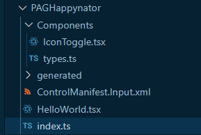


Build the code until now. This will generate also the changed types from the manifest:
```
npm run build
```

## Implement the cell renderer

This one is the renderer used when the cell is in read-only mode.
Create a subfolder "Customizer" and place there the customizers.
Create the file CellRendererOverrides.tsx inside the Customizer folder.
There create the renderer:
```typescript
export const cellRendererOverrides= {
   //content goes here
}
```

Now add the function definition for the TwoOptions. It will look like this:
```typescript
export const cellRendererOverrides= {
   ["TwoOptions"] : (props: CellRendererProps, rendererParams: GetRendererParams) => {
    //renderer goes here
   }
}
```

Now we'll detect the current column, and call the IconToggle. Replace the comment "//renderer goes here" with the following
```typescript
//check the column name
const column = rendererParams.colDefs[rendererParams.columnIndex];                         
if(column.name==="diana_ishappy"){           
    return (<IconToggle 
        iconOn="Emoji2" iconOff="Sad" colorOn="green" colorOff="red" 
        labelOn={(column as any).customizerParams.labels.onText} 
        labelOff={(column as any).customizerParams.labels.offText}
        value={props.value===true}       
        ></IconToggle>);        
}
```

## Index.ts

Open the "Index.ts" and locate the "init" method. Add following code: 
```typescript
    const eventName = context.parameters.EventName?.raw;
    if(eventName){
        const paOneGridCustomizer : PAOneGridCustomizer= {
            cellRendererOverrides : cellRendererOverrides
        };
        (context as any).factory.fireEvent(eventName, paOneGridCustomizer);            
    }
```

Then replace the "updateView" method with the following (we won't render anything here):
```typescript
    public updateView(context: ComponentFramework.Context<IInputs>): React.ReactElement {
        return React.createElement(React.Fragment);
    }
```

Now you can **delete the HelloWorld.tsx** and the import inside the index.ts; we can build and upload the PCF now:
```
npm run build
```

> **Note:** Before proceeding, make sure your pac cli is connected with the right environment.

```
pac pcf push -pp diana
```

## Customizing on the customizer control

1. Open the Solution "PCFTraining" and add the new uploaded PCF to the solution:
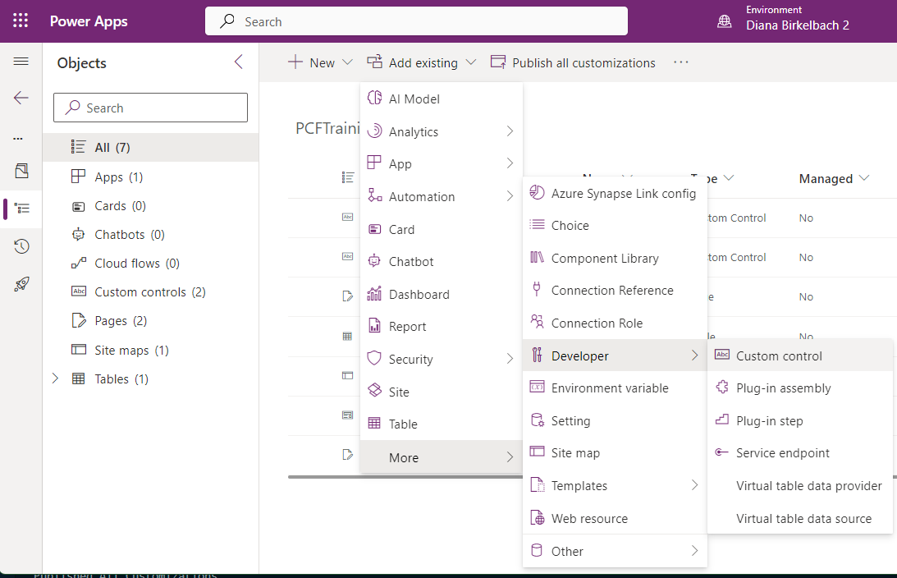
Pick the diana_Dianamics.PAGHappynator from the list:
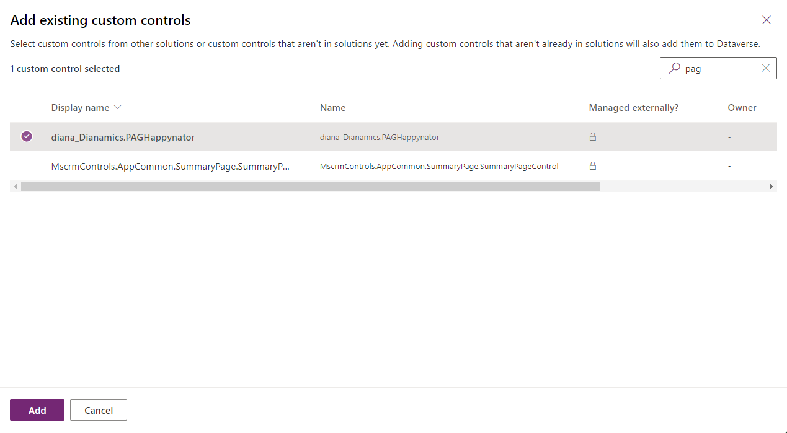

Select the solution and "Switch to classic" (we'll register it on the table pcf_training).
In the classic customizing, choose the "Entities", open the "PCFTraining", and then the tab "Controls". Click on the "Power Apps grid control" control, and scroll the properties all the way down, until you find the "Customizer Control":
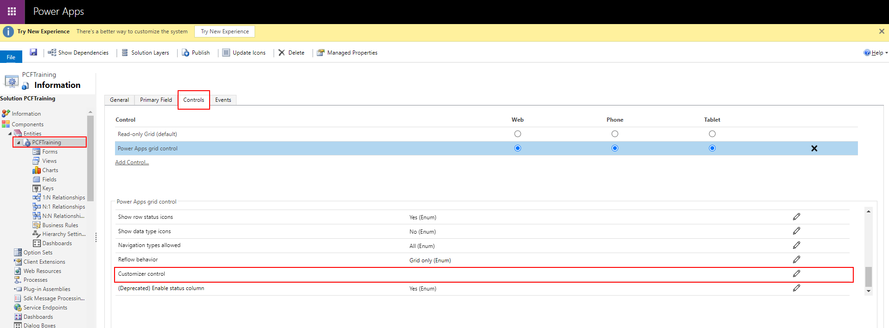

Paste the text "diana_Dianamics.PAGHappynator" inside the "static value" for the "Customizer Control":
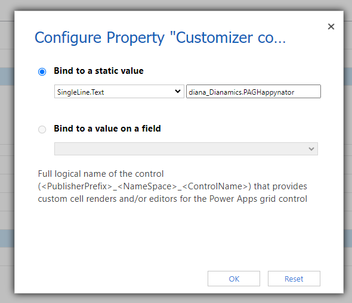

Now we're all set: Save and the Publish your changes.

## View the Happynator cell renderer

Now we can play the "PCFTrainingApp":
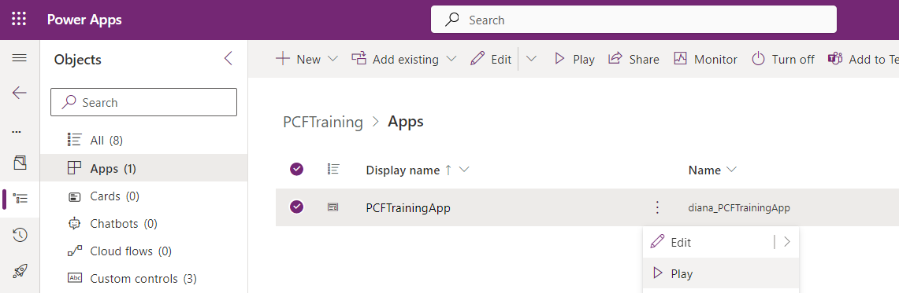

For the "PCFTraining" table, we can switch now to "Show As", and then "Power Apps grid control":
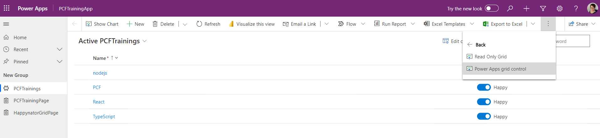

After a refresh, you should be able to see the Happynator control inside the Power Apps Grid.

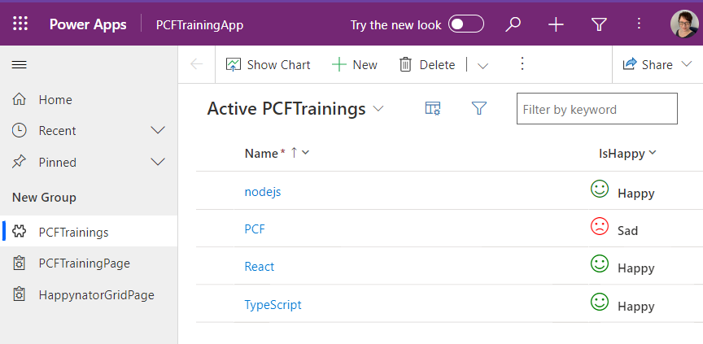

Right now we can edit only the name; a click on the IsHappy column won't have any effect. In the next step we'll implement the editor.

# Switch to edit mode

Now we need to switch to editor, when the user clicks on the toggle icon.

**Open the CellRendererOverrides.tsx** and change the cellRendererOverrides to this (you are adding an onChange, where you call startEditing):
```typescript
export const cellRendererOverrides= {
   ["TwoOptions"] : (props: CellRendererProps, rendererParams: GetRendererParams) => {
       const column = rendererParams.colDefs[rendererParams.columnIndex];
       if(column.name==="diana_ishappy"){      
            const onCellClicked = () => {
                if(props.startEditing){
                    props.startEditing(!props.value);
                }
            }             
            return (<IconToggle 
                iconOn="Emoji2" iconOff="Sad" colorOn="green" colorOff="red"
                labelOn={(column as any).customizerParams.labels.onText}
                labelOff={(column as any).customizerParams.labels.offText}
                value= {props.value ===true}            
                onChange={onCellClicked}  
            />);
       }
   }
}
```

Push the changes again to the envionment
```
pac pcf push -pp diana
```

Check that now we can switch the cell to edit mode, but we see the standard toggle as an editor:
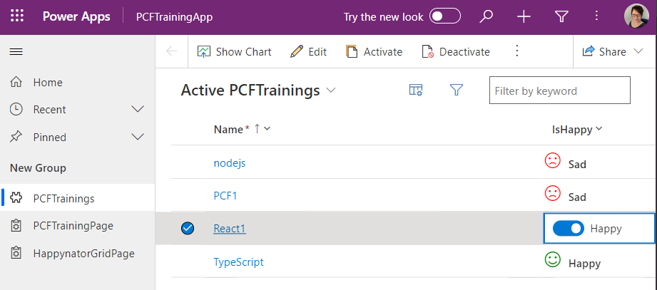


# CellEditor

Inside the Customizer folder, create the file CellEditorOverrides.ts (beside the CellRendererOverrides.tsx)

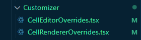

Start with the cellEditor definition
```typescript
import * as React from "react";
import { CellEditorOverrides, CellEditorProps, GetEditorParams } from "../Components/types";


export const cellEditorOverrides : CellEditorOverrides = {
    ["TwoOptions"] : (defaultProps: CellEditorProps, rendererParams: GetEditorParams) => {
        //editor goes here
    }
}
```

Replace the comment line with the following
```typescript
    const column = rendererParams.colDefs[rendererParams.columnIndex];
    if(column.name==="diana_ishappy"){         
        const onChange = (value ?: boolean) => {
            rendererParams.onCellValueChanged(value);
            //the stopRditing is needed because with one click the editing process is done.            
            rendererParams.stopEditing(false);
        }
        return (<IconToggle 
            iconOn="Emoji2" iconOff="Sad" colorOn="green" colorOff="red"
            labelOn={(column as any).customizerParams.labels.onText}
            labelOff={(column as any).customizerParams.labels.offText}
            value= {defaultProps.value ===true}
            onChange={onChange}
        />);
    }
```


## Registering the editor in Index.ts
The last step: open the Index.ts and register also the celleditor.
Change the definition of paOneGridCustomizer to the following:
```typescript
 const paOneGridCustomizer: PAOneGridCustomizer = { 
                cellRendererOverrides: cellRendererOverrides, 
                cellEditorOverrides : cellEditorOverrides
            };
```

You can push the changes to the environment now:
```
pac pcf push -pp diana
```
Refresh the grid, and check that a click on the "IsHappy" column is changing the value. We can click several times on the same control, the cell is makered as editable (blue border)
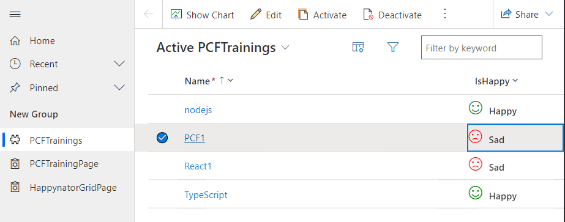